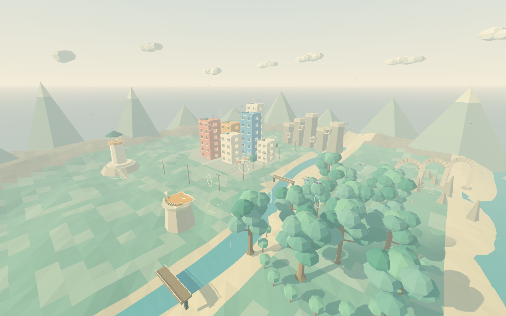

# SOARING — The Wild Sky (godot-sol)

A playable Godot VR flight sandbox: become a bird, catch smaller birds, evade larger ones, and grow through five tiers in a living low-poly valley. Built and tested with Godot **4.7.2**, OpenXR, and Meta XR Simulator's **Quest Pro** profile. A physical Quest Pro session is still needed to judge comfort, fatigue, controller feel and sustained headset performance.



## Play

Open `project.godot` in Godot 4.7.2, or run from this directory:

```sh
# VR — requires an active OpenXR runtime
godot --path . --xr-mode on

# Desktop practice
godot --path . --xr-mode off
```

The game opens at the launch nest. Select **Take Flight**. The eight-second launch grace gives you time to learn the air. Teal rings identify useful prey; coral rings identify threats. A catch requires the predator to be at least 18% larger. Eating birds near your size provides useful growth; birds below 12% of your mass stop providing growth. Reach **8.0 mass** to become Sovereign; you can keep flying afterward. Being caught displays your results and lets you restart. This v1 is a local player and NPC ecosystem.

## VR controls

| Action | Gesture or controller |
| --- | --- |
| Flap | Short, deliberate downstrokes. Raise a hand again to prepare the next stroke. One hand also works. |
| Lift and slow approach | Spread the wings; tilt wrists upward to increase incidence. |
| Dive and accelerate | Bring the wings inward; tilt wrists downward. Both triggers also tuck. |
| Turn | Raise one wing and lower the other; bank toward the lower wing. |
| Rest your arms while gliding | Hold **both grip buttons** with elbows relaxed. This maintains virtual wing spread. |
| Flap assist / take off from a perch | Press **A or X**. Holding it does not repeat. |
| Snap turn | Right thumbstick left/right, 30° per deliberate deflection. |
| Pause / resume | Left controller **Menu** button. |
| Menus | Point either controller and press its index trigger. |
| Recalibrate | Menu's **Calibrate wings (2s)**. Relax both elbows during the countdown. |

Initial calibration waits for valid tracking. Keep your arms in a comfortable neutral pose at launch; explicit calibration lets you customize that pose. You do not need to hold your arms fully extended to stay aloft. Use grips, thermals and perches to rest. Comfort starts enabled: level horizon, snap turns, and a speed vignette. Disabling it adds a mild visual bank.

## Desktop controls

**Space** flap; **A/D** bank; **W/S** pitch; **Shift** tuck; **Ctrl** spread/brake; **Q/E** snap turn; mouse look; **Escape** pause; **C** calibrate. Click menu buttons normally.

## Explore

The roughly 410-metre valley contains a hollow building quarter with 222 physically open windows, a grove with 108 branches, utility poles and collidable wires, coastal arches, five nest entrances, 175 resting points and six warm updrafts. Gold spirals and ground arrows mark rising air. Three optional ring trails reward precise flying. Slowing onto a branch or ledge settles into a perch; an intentional flap launches again. The horizon, terrain and boundaries stay the same size as you grow; your hull, wings and flight response change.

54 bird slots populate the food web. NPCs hunt other NPCs, flee larger birds, circle thermals, approach perches, rest, grow from catches and respawn. They also react to the player. Collision checks, swept catches and line of sight keep encounters from tunnelling through walls.

## Verification workflow

Run the suites sequentially so independent Godot instances do not contend for the project's import cache:

```sh
python3 tools/verify.py --visual
```

This imports the project, runs 461 flight/world/ecology/game checks, audits 96 moving-camera Mobile/Vulkan frames, and renders seven inspection views. Reports and images are written to `artifacts/`. The visual pass must be reviewed as well as the numeric checks. See [validation evidence and hardware acceptance](docs/VALIDATION.md).

For actual simulator input on macOS:

```sh
python3 -m venv /private/tmp/soaring-xr-env
/private/tmp/soaring-xr-env/bin/pip install -r tools/requirements-xr.txt
/private/tmp/soaring-xr-env/bin/python tools/verify_xr.py
```

Enable Meta XR Simulator as the system OpenXR runtime, select Quest Pro, 72Hz and its standard controller poses/bindings. macOS uses Forward+ with 2× MSAA and 65% internal resolution to avoid artifacts in the host Mobile/Vulkan stereo path; the Quest export uses Mobile with 4× MSAA and full resolution. Close any other running XR game. The test launches Soaring, drives the runtime's real ray/trigger, both downstrokes, bank, flap assist and Menu inputs, and checks live game telemetry. It sends transient key states through the installed runtime's local RPC protocol; it does not change simulator preferences. The client derives protocol definitions from that installed runtime and will fail explicitly if its protocol becomes incompatible.

Simulator movement: **[ / ]** cycle the active input; **R/F** move it up/down; **W/A/S/D** translate; **T** index trigger; **U** grip; **B** A/X; **M** left Menu. Selecting the right input makes M unavailable because the menu button belongs to the left controller. For a default compact two-hand neutral pose, cycle both hands independently and make short R/F strokes. The simulator reports zero native controller velocity; the game correctly derives stroke velocity from position samples.

## Quest build

The headset app is named **Soaring godot-sol**, with package ID `com.soaring.godotsol`. A debug-signed, ARM64 Quest APK is in `artifacts/soaring-godot-sol-quest.apk`. Godot's matching export templates, Android SDK and JDK17 are needed to rebuild:

```sh
# First export installs the matching Android project template.
godot --headless --xr-mode off --path . --install-android-build-template \
  --export-debug 'Meta Quest' artifacts/soaring-godot-sol-quest.apk

# Subsequent exports
godot --headless --xr-mode off --path . \
  --export-debug 'Meta Quest' artifacts/soaring-godot-sol-quest.apk

# Once a developer-mode headset is connected and authorized
adb install -r artifacts/soaring-godot-sol-quest.apk
adb shell am start -a android.intent.action.MAIN -c com.oculus.intent.category.VR \
  -n com.soaring.godotsol/com.godot.game.GodotAppLauncher
```

The simulator runs the desktop OpenXR build; it does not emulate Android APK execution. The APK is packaged and inspected separately. **Soaring godot-sol** was installed and successfully launched on a connected Quest Pro on 2026-10-04, with native Godot/OpenXR startup verified. Physical playtesting and performance acceptance remain open. No Internet, microphone, camera, eye tracking or hand tracking permission is used by this game.

## Implementation and assets

- `scripts/flight/`: position-based gesture recognition, arcade aerodynamic model, tracked player and collision/perch handling.
- `scripts/world/world.gd`: original batched procedural world and colliders, updrafts, perches and route probes.
- `scripts/ecology/`: five bird tiers, original animated geometry, food web and collision-aware steering.
- `scripts/main.gd`: assembled game, XR menu rays, pause, calibration, comfort, feedback and diagnostic captures.
- `scripts/ui/` and `scripts/audio.gd`: menus/HUD and original synthesized audio.
- `tests/`: deterministic subsystem and complete scene tests.

All gameplay art and audio were created procedurally for this project. [Third-party notices](docs/THIRD_PARTY.md) cover the bundled Godot OpenXR Vendors extension and Meta loader. Setup was informed by the existing `meta-demo` project. CLI usage follows [Godot's command-line documentation](https://docs.godotengine.org/en/stable/tutorials/editor/command_line_tutorial.html).
